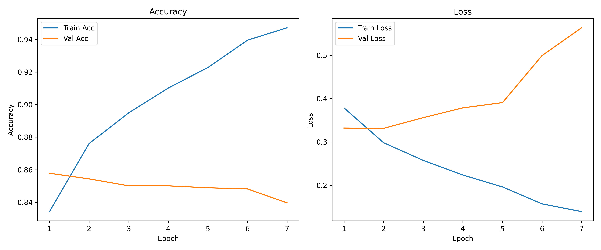
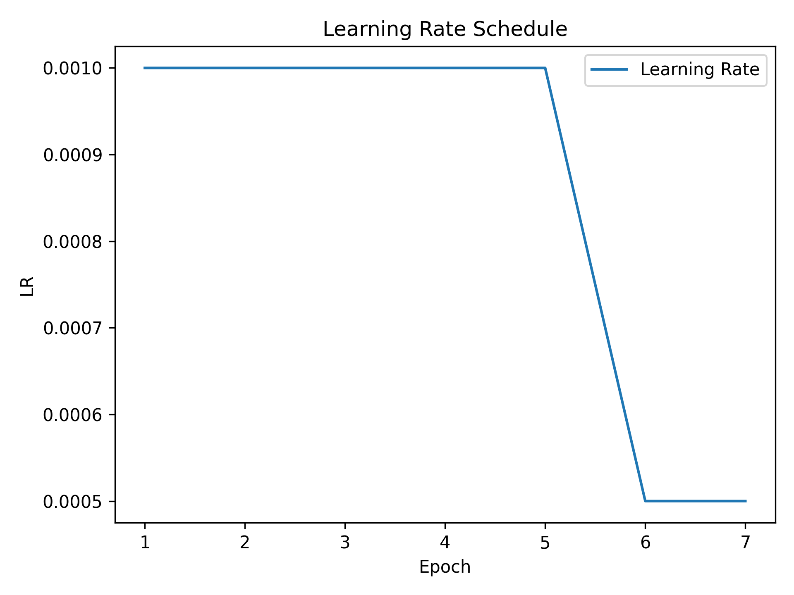
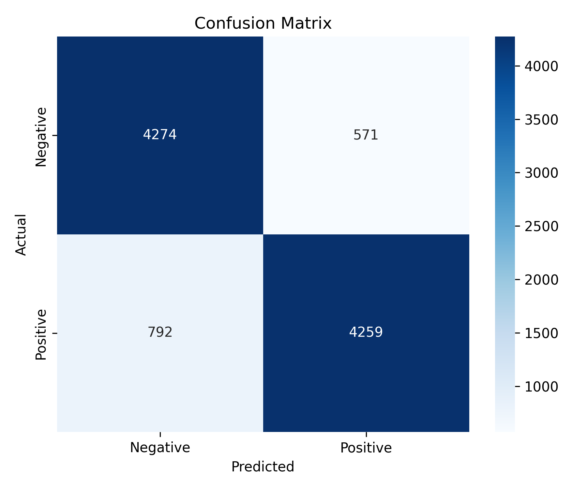

[](https://github.com/sara-kaveh/snappfood-reviews-sentiment-analysis)

# SnappFood Reviews Sentiment Analysis using Bidirectional LSTM

A deep learning project for **binary sentiment analysis of Persian user reviews** from the **SnappFood** dataset. It applies Persian text normalization and tokenization before training a Bidirectional LSTM classifier.

---

## Features

* Persian text normalization using **Hazm**
* Tokenization with TensorFlow/Keras
* Bidirectional LSTM architecture
* Early Stopping
* ReduceLROnPlateau learning rate scheduling
* Best model checkpointing
* Saved tokenizer for inference
* Performance visualization

---

## Dataset

This project uses the **Cleaned SnappFood Persian Sentiment Analysis Dataset** available on Kaggle:

[Kaggle - Cleaned SnappFood Persian Sentiment Analysis Dataset](https://www.kaggle.com/datasets/mohammad1ziyar/cleaned-snappfood-persian-sentiment-analysis)

The dataset contains approximately 66K Persian user reviews before preprocessing.

Each review is labeled as:

* Positive
* Negative

---

### Dataset Split

The dataset was divided using stratified sampling:

<div align="center">

| Split | Percentage |
|---|---:|
| Training | 72.25% |
| Validation | 12.75% |
| Testing | 15% |

</div>

Stratification was applied to preserve the class distribution.

---

## Data Preprocessing

Before training, the dataset undergoes several preprocessing steps.

### Text Normalization

Persian text is normalized using **Hazm**, including:

* Character normalization
* Standardizing Persian/Arabic characters
* Removing unnecessary spaces
* Cleaning formatting inconsistencies

Although the dataset was pre-cleaned, Hazm normalization was applied to ensure consistent Persian character representation during training and inference.

### Tokenization

The cleaned text is converted into integer sequences using the Keras Tokenizer.

Configuration:

* Vocabulary Size: **15,000**
* OOV token enabled

### Sequence Padding

Since reviews have different lengths, sequences are padded to a fixed size.

* Maximum sequence length: **40**
* Post-padding
* Post-truncation

---

## Model Architecture

<div align="center">

<pre>
Input Text
     │
Hazm Normalization
     │
Keras Tokenizer
     │
Padding (Length=40)
     │
Embedding
(Vocabulary=15000, Dimension=128)
     │
Bidirectional LSTM (128, dropout=0.2)
     │
Bidirectional LSTM (64, dropout=0.2)
     │
Dropout (0.5)
     │
Dense (64, ReLU)
     │
Softmax Output (2 classes)
</pre>

</div>

---

## Hyperparameters

<div align="center">

| Parameter               |   Value |
| ----------------------- | ------: |
| Vocabulary Size         |  15,000 |
| Maximum Sequence Length |      40 |
| Embedding Dimension     |     128 |
| BiLSTM Units            | 128, 64 |
| Dense Units             |      64 |
| Dropout                 |     0.5 |
| Batch Size              |      64 |
| Learning Rate           |   0.001 |
| Epochs                  |      10 |
| Optimizer               |    Adam |

</div>

---

## Training Strategy

The model was trained using several techniques to improve convergence and reduce overfitting.

### Early Stopping

* Monitor: Validation Loss
* Patience: 5

### Learning Rate Scheduling

ReduceLROnPlateau automatically decreases the learning rate when validation performance stops improving.

### Model Checkpoint

The best-performing model is automatically saved according to validation loss.

---

## Results

### Test Performance

<div align="center">

| Metric          | Score |
| --------------- | :---: |
| Accuracy        | **86%** |
| Macro Precision | **86%** |
| Macro Recall    | **86%** |
| Macro F1-score  | **86%** |

</div>

---

### Classification Report

The model achieved consistent performance across both sentiment classes, showing that it learned meaningful sentiment patterns from Persian reviews.

<div align="center">

| Class | Precision | Recall | F1-score | Support |
|---------|---------:|------:|--------:|--------:|
| Negative | 0.84 | 0.88 | 0.86 | 4,845 |
| Positive | 0.88 | 0.84 | 0.86 | 5,051 |
| **Accuracy** | | | **0.86** | **9,896** |
| **Macro Avg** | **0.86** | **0.86** | **0.86** | **9,896** |
| **Weighted Avg** | **0.86** | **0.86** | **0.86** | **9,896** |

</div>

#### Observations

- The model achieved an overall **test accuracy of 86%**.
- Performance is well balanced across both sentiment classes, with identical **F1-scores (0.86)** for Positive and Negative reviews.
- The **Negative** class obtained a slightly higher **recall (0.88)**, indicating that the model successfully identifies most negative reviews.
- The **Positive** class achieved a higher **precision (0.88)**, meaning positive predictions are highly reliable.
- The similar macro and weighted averages suggest that the model generalizes consistently across the dataset without a strong bias toward either class.

---

### Training Curves

The repository includes:

* Training Accuracy
* Validation Accuracy
* Training Loss
* Validation Loss

These plots illustrate the convergence behavior of the model throughout training.

<p align="center">
  
</p>

---

### Learning Rate Schedule

The repository also includes the learning rate schedule generated during training.

<p align="center">
  
</p>

---

### Confusion Matrix

The confusion matrix provides a detailed view of prediction performance on the test set.

<p align="center">
  
</p>

---

### Training Log

Training history is available, including:

<div align="center">

| Epoch | Train Accuracy | Train Loss | Learning Rate | Validation Accuracy | Validation Loss |
|------:|---------------:|-----------:|--------------:|--------------------:|----------------:|
| 0 | 83.21% | 0.3761 | 0.0010 | 85.83% | 0.3278 |
| 1 | 87.78% | 0.2946 | 0.0010 | 86.01% | 0.3387 |
| 2 | 89.58% | 0.2551 | 0.0010 | 85.44% | 0.3503 |
| 3 | 90.92% | 0.2233 | 0.0010 | 85.50% | 0.4016 |
| 4 | 93.01% | 0.1755 | 0.0005 | 85.16% | 0.4534 |
| 5 | 93.88% | 0.1551 | 0.0005 | 84.64% | 0.4979 |

</div>

---

## Example Predictions

<div align="center">

| Confidence | Prediction | Persian Review |
|-----------:|:----------:|:--------------|
| 99.25% | Positive | کیفیت غذا عالی بود و خیلی خوشمزه بود |
| 90.26% | Negative | غذا سرد رسید و اصلا کیفیت خوبی نداشت |
| 95.87% | Positive | ارسال خیلی سریع بود و از سفارش راضی هستم |
| 95.40% | Negative | بدترین تجربه‌ای بود که داشتم، دوباره سفارش نمی‌دهم |
| 74.36% | Negative | غذا معمولی بود، نه خوب نه بد |

</div>

---

## Project Structure

```text
├── data/
│   └── cleaned_snappfood.csv
├── models/
│   ├── label_encoder.pkl
│   ├── tokenizer.pkl
│   └── best_model.keras
├── results/
│   ├── classification_report.txt
│   ├── confusion_matrix.png
│   ├── learning_rate_schedule.png
│   ├── training_curves.png
│   └── training_log.csv
├── config.py
├── data_preprocessing.py
├── inference.py
├── main.py
├── models.py
├── train.py
├── predict.py
├── visualization.py
├── requirements.txt
└── README.md
```

---

## Author

**Sara Kaveh**

GitHub: https://github.com/sara-kaveh
